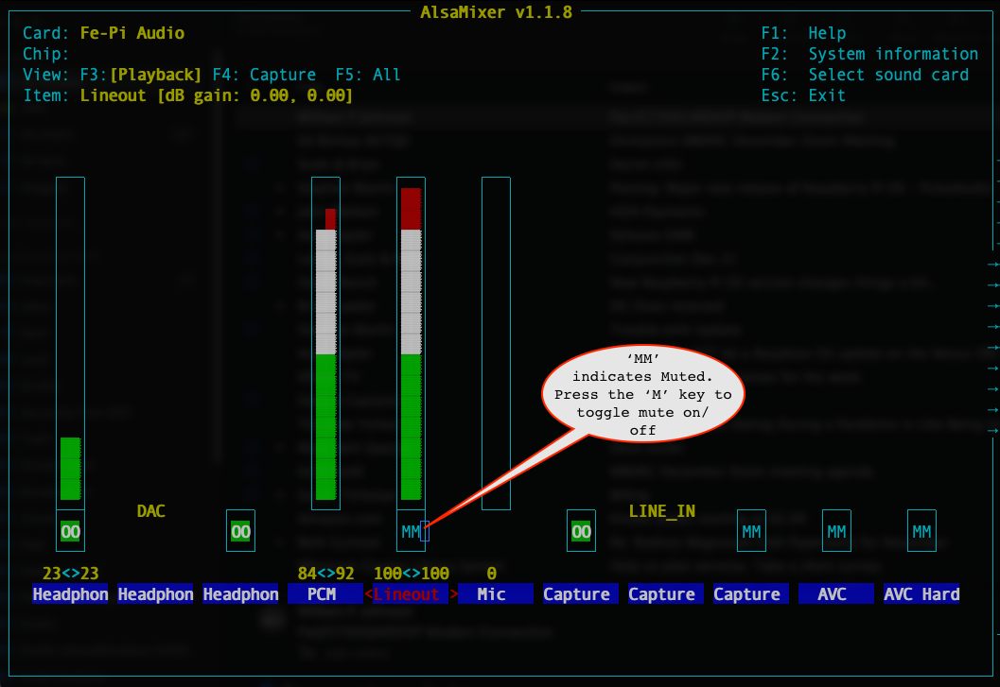

# Nexus DR-X Pi Image

Version 20201212.3

Author: Steve Magnuson, AG7GN

## Prerequisites

- Raspberry Pi 3B, 3B+ or 4B.  The 2GB version of the 4B is fine.
- [Fe-Pi Audio Z Version 2 sound card](https://fe-pi.com/products/fe-pi-audio-z-v2)
- Budd Churchward's ([WB7FHC](http://wb7fhc.com/index.html)) excellent [Nexus DR-X](http://wb7fhc.com/intro.html) board. The DigiLink is no longer made.
- 16GB or greater MicroSD card ([a 32GB or larger card is best](https://raspberryinsider.com/what-the-largest-micro-sd-card-supported-the-by-raspberry-pi/)). I've found that the [SanDisk 32GB Extreme PLUS microSDHC](https://www.officedepot.com/a/products/225929/SanDisk-Extreme-PLUS-microSDHC-Memory-Card/) is very fast and reliable. Samsung and SanDisk are among the most reliable cards.
- OPTIONAL: Speakers attached to Pi's built-in audio jack or an HDMI monitor with speakers if you want to monitor the radio's TX and/or RX or use Fldigi's audio alerts feature

This image uses the default configuration for user __pi__:  
- User pi's home directory is __/home/pi__
- User __pi__ has passwordless __sudo__ privileges.  
- The desktop automatically starts without requiring a password for user __pi__.

## Default Password

The default password for user __pi__ is __changeme__.  __*PLEASE CHANGE THIS* as described below!__

## Features

- Uses the latest stable Debian 10 (Buster 10.6) Raspberry Pi OS (aka "Raspbian")

- Fldigi, Flmsg, Flamp, Flarq are installed and minimally configured to use PulseAudio and 1 or 2 radios.  You must set your call sign and name, among other things, in the Fldigi and Flmsg settings.
- Flrig is installed and configured for use with 1 or 2 radios, but it is not visible on the __Hamradio__ menu by default.  See the [Customize the Main Menu](#customize-the-main-menu) section for information on customizing the menu.
- Direwolf is installed and configured for use with PulseAudio with 1 or 2 radios.
- You'll see __RMS Gateway Manager__ in the __Hamradio__ menu.  __Most users should ignore this menu item.__ This is only needed if you want this Pi to operate as an [RMS Gateway](https://www.winlink.org/tags/gateway).  

	__*Note that operating an RMS Gateway requires that you obtain a "Sysop" account at winlink.org.*__ There are [other requirements](https://www.winlink.org/content/join_gateway_sysop_team_sysop_guidelines) as well.  If you operate the Pi as an RMS Gateway, I recommend that you don't use the Pi for any other purpose.
- There are menu items to toggle on and off TX and RX audio monitoring.  This only works if you have speakers connected to your Pi's built-in audio jack or your HDMI monitor has speakers.
- Recognizes and enables a DS3231 Real Time Clock module, if installed.
- A script is installed and enabled to restart or shutdown the Pi if the pushbutton on the board is pressed (DigiLink Rev __DS__ or [Nexus DR-X](http://wb7fhc.com/intro.html) boards only).  
	- If the button is pressed for 2 <= *t* < 5 seconds then released, the Pi will reboot.  
	- If the button is pressed for *t* >= 5 seconds then released, the Pi will shutdown. 
		- Note that newer versions of the Nexus DR-X have an LED that turns on when the button is pressed for 2 <= *t* < 5 and turns off again when the button continues to be pressed for *t* >= 5 to give you a visual cue as to when to release the button to reboot or shutdown.			  
		- Older "DigiLink" boards (prior to the [Nexus DR-X](http://wb7fhc.com/intro.html)) must have the GPIO jumper installed in the '26' position for this to work.  If you want to use GPIO 13 or 6 instead (by moving the DigiLink GPIO jumper), you can edit the `/usr/local/bin/shutdown_button.py` file and set the `use_button` variable to 13 or 6 respectively.  The [Nexus DR-X](http://wb7fhc.com/intro.html) board is hard wired to GPIO 26 for this purpose - it cannot be changed.
- Watchdog service is enabled.  If the Pi locks up, it *should* automatically reboot within 10 seconds.
- Includes a GUI called the "Updater" (__Raspberry > Hamradio > Nexus Updater__) to make it easier to install and update various ham applications.
- Supports bootup user scripting based on the lever positions of the piano switch on the [Nexus DR-X](http://wb7fhc.com/intro.html) board.  A sample user script is in `/home/pi/pianoX.sh.example`.  Here's more information about [how it works](https://github.com/AG7GN/hampi-utilities/blob/master/README.md#check-piano-script).

## New in This Version

- Latest OS (Buster 10.6) and Raspberry Pi application updates.
- Buster 10.6 has a new easy to use printer manager in __Rapsberry > Preferences > Print Settings__. The __Manage Printers__ menu item is still there and opens the CUPS web interface. __Print Settings__ is easier to work with, though. 
- Incorporates Fe-Pi sound card in Raspbian's new embrace of [PulseAudio](https://github.com/AG7GN/nexus-audio/blob/main/README.md).
- Fldigi, Flrig, Flmsg, Direwolf and pat have been updated to the latest versions.
- A new Updater, the __Nexus Updater__, has replaced __Update Pi and Ham Apps__.
- These apps are now available for installation in the __Nexus Updater__:

	- CQRLog
	- Gpredict
	- Linpac
	- QSSTV
	- Uronode
	- YAAC
	
	*Important:* Note that I have not tested these applications beyond making sure they install on the Nexus!  Also, the Updater only installs applications. It does not configure them for you. Consult the documentation for the app for information on configuring it.
	
	If you use an application that can use PulseAudio, start your application like this:
	
		PULSE_SINK=fepi-playback PULSE_SOURCE=fepi-capture name-of-application [arguments]

	This will tell PulseAudio to use the Fe-Pi card for the sound for this application.
	
## Installation

__*Attention Current Nexus Users:*__ If you're already running an earlier version of the Nexus image, you have a tool available that allows you to back up the contents of your home folder to a USB stick/drive. It's located at __Raspberry > Hamradio > Backup/Restore Home Folder__. Use it to make a copy of your home folder prior to following the rest of this procedure. Then, once you're running the new image, install the __nexus-backup-restore__ script using the Updater (__Raspberry > Hamradio > Nexus Updater__) and run __Raspberry > Hamradio > Backup/Restore Home Folder__
and follow the instructions to restore the contents of your home folder from your USB stick/drive to the new image. This allows you to have your Fldigi setup, macros, etc, and other ham apps configuration on your new image without having to configure everything again.

1. Assemble [Nexus DR-X](http://wb7fhc.com/intro.html) board and install it and the Fe-Pi audio board onto the Pi.
1. The Nexus DR-X Pi image is larger than the allowed file size on GitHub, so I store the image on a Google Drive.  The Nexus DR-X Pi image is approximately 3.2 GB.  
	- [Access my Google Drive](https://drive.google.com/file/d/1gLUDK7K5ZHgNC5dPZbX27F-Rvef14tAK/view?usp=sharing) 
	- Click the __Download__ button when prompted with "Couldn't preview file...".
1. [OPTIONAL] After you've downloaded the ZIP file, verify it's integrity by running a checksum calculator program. This will tell you that you've downloaded the image that I uploaded. The SHA256 checksum for the above image is:

		f56acaa11a456f20a7151cbe9d74bfcf34a9737b602651ec67fd98003953932f
	
	- If you downloaded the above ZIP file to a Mac, run this command in Terminal in the folder where you downloaded the file:
	
			shasum -a 256 nexusdrxpi20201212.zip
		
		Your Mac may auto-unzip the ZIP file (making a `.img` file) upon downloading, but the original ZIP file should be in your downloads folder.
				
	- If you downloaded the above ZIP file to a Linux PC, run this command in Terminal in the folder where you downloaded the file:
	
			sha256sum nexusdrxpi20201212.zip
			
	- If you downloaded the above ZIP file to a Windows 10 PC, run this command in the Command Prompt window in the folder where you downloaded the file:
	
			CertUtil -hashfile nexusdrxpi20201212.zip SHA256
			
	In all cases, the checksum string returned by your command should match the checksum string above. Thanks to David Ranch, KI6ZHD, for his suggestion to add this step to the installation instructions.

1. Burn the image to your SD card. There are many ways to do this. The easiest is to download the [Balena Etcher](https://www.balena.io/etcher/) app for your OS (supports Linux, Windows, Mac). The Balena Etcher is easy to use and you don't have to unzip ZIP or `.tar.gz` files containing images prior to burning them to the microSD card.

	Alternatively, the official "Raspbian" way to burn the image is to use the [Raspberry Pi Imager](https://www.raspberrypi.org/software/). 

1. Insert the microSD card you just imaged into the Pi and power it on.
1. The easiest way to get your Pi set up on first boot-up is to connect it to a keyboard/video/mouse (KVM).  However, there is an alternative way to access your new Pi without a KVM, even before you've configured it:  

	- By default, the [VNC server](https://github.com/AG7GN/images/blob/master/README-Using_VNC_to_Operate_Remotely.md) is enabled on the Pi.  If you plug your Pi into an ethernet port on your home network and [install the VNC Viewer application](https://www.realvnc.com/en/connect/download/viewer/) on another PC or Mac or Chromebook also on your home network, you can connect to and control your new Pi using VNC Viewer from that PC or Mac or Chromebook.  
	- Once the Pi has fully booted up, open VNC Viewer on your other computer and enter `nexus.local` into the address bar at the top of the VNC Viewer window, then press __Enter__.  Follow the instructions and login with Username __pi__ and the default password __changeme__.  
	
## First Time Boot Instructions

__*PLEASE* DO THESE STEPS before seeking help!__

1. You'll notice the first time you start the Pi with this image that it immediately reboots within a few seconds of the desktop appearing.  This is expected behavior and is caused by a script that runs on first boot that resets the VNC and SSH client and server keys among other things.  This happens only at the first boot-up.  Also, the first time bootup takes a bit longer than usual because the filesystem is expanded to the size of the microSD card.

1. Connect your Pi's ethernet port to your home network or use the Pi's wifi to connect to your home network.  For WiFi:
	- Click on the network icon (just to the left of the speaker icon) on the Pi's top menu bar.  
	- Select your WiFi network from the list (NOTE: it make take a minute or 3 for the WiFi networks your Pi can see to appear in that list) and follow the instructions on the screen.
	
1. Click __Raspberry > Preferences > Raspberry Pi Configuration__, then click __Change Password__ to set your password.  Click __OK__, and __OK__ again.  

1. If the outside edge of the desktop appears cut off on your monitor or your desktop doesn't fully fill your monitor's screen, enable or disable __Overscan__ as needed to fix the problem.  

1. Change the Hostname of your Pi as desired - don't leave it set to `nexus`.  It's a good idea to include your call sign in the hostname to make it unique.  Example: __nexus-ag7gn__.  By convention, hostnames are lower case, but there's no harm in using capital letters.  You can use any name, but the only non-alphanumeric character allowed is a dash (-).

1. Click __OK__.

1. Click __Yes__ if prompted to reboot.

1. When the desktop appears, run the Updater: Click __Raspberry > Hamradio > Nexus Updater__, then, *only if prompted to do so*, re-run __Raspberry > Hamradio > Nexus Updater__.  Check __Raspbian OS and Apps__ and click __OK__.  Reboot if prompted.

1. Click __Raspberry > Hamradio > Nexus Updater__ to run the Updater.  Check the application(s) you want to update or install and click __OK__.  Some installations take a very long time.  Don't install an application unless you understand what the application is for.  __*Installing an application does not configure it*__. Consult the documentation for that application for configuration instructions.

	You can double-click on the app name in the Updater to obtain information about that app.  This will open the Chromium browser and and take you to the website for that app.

1. As you already know from the [First Time Boot Instructions](#first-time-boot-instructions), checking the __Raspbian OS and Apps__ item in the Updater will check for and install OS updates.  This is equivalent to running the following commands in a Terminal:

		sudo apt update
		sudo apt -y upgrade
		
1. Check the __Bugs__ and __Annoyances__ sections below for additional information.

## Customize the Main Menu

This is __OPTIONAL__ - only if you want to change what appears on the menu or the menu layout.

__WARNING:__ There is a long time bug in the Main Menu Editor that resets the menu settings to default when you click the __Cancel__ button.  So, *NEVER* click the __Cancel__ button!  Even if you made no changes, click __OK__ instead.

Also, be aware that if a menu, like the __Hamradio__ menu, has too many enabled items in it such that the menu grows beyond the vertical dimensions of the screen, those items at the end of the list won't appear in the menu.

FYI: If you make changes (other than it's placement/order in the menu) to a particular menu item, a new desktop file will be created in `/home/pi/.local/share/applications` and that file will be used to populate the menu even if there is a `.desktop` file with the same name in the default location `/usr/local/share/applications`. 

1. Click __Raspberry > Preferences > Main Menu Editor__.  

1. Select __Hamradio__ in the left pane.
1. Check or uncheck the applications listed in the center pane as desired.
1. Click the __Up__ or __Down__ buttons to move the selected item up or down in the menu list.  Add or remove separators in the menu list as desired.
1. Click __OK__ (*never* click __Cancel__!) when done.

If you delete a `*.desktop` file from `/home/pi/.local/share/applications` or `/usr/local/share/applications`, it won't appear as an available selection in the Main Menu Editor. Simply unchecking an item in the editor does not delete the `*.desktop` file.

## GPIO Pins

The Nexus DR-X Pi image and the Nexus DR-X board use the following GPIO pins (BCM numbering):

| GPIO Pin (BCM) | Purpose |
| :---: | :---: |
| 12 | PTT Left Radio |
| 23 | PTT Right Radio |
| 26 | Shutdown Button |
| 24 | Shutdown Button LED |
| 25 | Piano switch position 1 |
| 13 | Piano switch position 2 |
| 6 | Piano switch position 3 |
| 5 | Piano switch position 4 |

You can test PTT operation using `raspi-gpio` in the Terminal. For example, here's how to test PTT on the left radio (GPIO BCM pin 12):

- Set BCM pin 12 as output:

		raspi-gpio set 12 op
		
- Set BCM pin 12 state to high (PTT ON):

		raspi-gpio set 12 dh

- Set BCM pin 12 state to low (PTT OFF):

		raspi-gpio set 12 dl

These commands can also be used in scripts and in certain ham radio applications that allow scripting to control PTT.

## Fldigi Notes

### Customize the Fldigi Apps

As I mentioned earlier, for those of you who were running an earlier Nexus DR-X image, you can restore your backed-up home folder from the previous image and not have to set up Fldigi, etc. as described here.

1. In Fldgi: __Configure > UI > Operator__.  Note you have to do this for both the __Fldigi (Left Radio)__ *and* __Fldigi (Right Radio)__ menu items.

1. In Flmsg: __Config > Personal__ tab.  Note that you have to do this for both the __Flmsg (Left Radio)__ *and* __Flmsg (Right Radio)__ menu items.

1. See the [Nexus Audio](https://github.com/AG7GN/nexus-audio/blob/main/README.md) documentation about how Fldigi uses PulseAudio and the Fe-Pi, as well as information on how to set up audio alerts. Recent versions of Fldigi have changed the way aduio levels are depicted in the waterfall and signal displays sometimes making input audio appear too high when that may not be the case. 

### FSQ on Fldigi

See [KC9AD's notes on using FSQ](http://doutre.org/fsqNotes.txt).

## Direwolf Notes

If you want to use Direwolf as an AX25 TNC with or without the pat Winlink client, you can run __Raspberry > Hamradio > Direwolf TNC and pat GUI__. This application will allow you to configure Direwolf and pat using a GUI rather than editing text files. You can also monitor Direwolf and pat events. 

There's also a Direwolf APRS GUI at __Raspberry > Hamradio > Direwolf APRS GUI__. You can configure your Pi to be an APRS iGate and/or digipeater and optionally have it start automatically at boot up via the Nexus piano switches.

Some hams will want to use Direwolf in a way that these GUIs won't accomodate. [Please read these notes](https://github.com/AG7GN/images/blob/master/README-direwolf.md) if this applies to you.

## Operating Your Pi "Headless" (without a keyboard, monitor or mouse)

This is __OPTIONAL__.  See [these instructions](https://github.com/AG7GN/images/blob/master/README-Using_VNC_to_Operate_Remotely.md).

## [OPTIONAL and ADVANCED] Backing up your Pi via Secure Shell (SSH) over a network

If you have another Linux host, you can use the `ssh-image.sh` script in this repository to make an image of a running Raspberry Pi using an SSH connection.  You'll need the following for this to work:

- Some Linux and SSH experience.
- The `ssh-image.sh` script in this repository.
- The Winlink client `pat` app and the `patmail.sh` (both are installed by default) script if you want the `ssh-image.sh` script to automatically email you with the results.  This is handy of you run the script via cron.
- SSH keypair with a passphrase-less private key (not recommended) or a keychain (recommended) on your Linux host.

See the description at the beginning of the `ssh-image.sh` script for details.

## Bugs

Probably.  WATCH THIS SPACE.  I will post bug information and workarounds here.

## Annoyances

Things that aren't really bugs, but irritating nevertheless will be documented here.

### Fe-Pi Line Out initially muted

Most users are seeing that on first boot the Line Out of the Fe-Pi is muted. Here's how to fix:

- Open Terminal and run:
	
		alsamixer
		
- Press __F6__ and select the __Fe-Pi__ card.

- Use your left/right arrow keys to move to the __Lineout__ control. If it says __MM__ as shown in this screenshot, it's muted. Press __M__ to unmute, then __Esc__ to exit `alsamixer`.

	
	

## Related Information

[Nexus DR-X + PulseAudio: Adjusting Audio Levels](https://github.com/AG7GN/nexus-audio/blob/main/README.md)

[Configuring and Using Auto-HotSpot](https://github.com/AG7GN/images/blob/master/README-auto_hotspot.md)

[Operating Your Nexus "Headless"](https://github.com/AG7GN/images/blob/master/README-Using_VNC_to_Operate_Remotely.md)

[Direwolf Notes](https://github.com/AG7GN/images/blob/master/README-direwolf.md)

